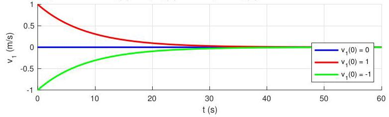

# Solution

## Method
The solution to the first-order differential equation from P2.18 when \( \tau  = 0 \) is

\[
\omega \left( t\right)  = \omega \left( 0\right) {e}^{-{\lambda t}},\;\lambda  =  - \frac{{b}_{1} + {b}_{2}}{{J}_{1} + {J}_{2} + {r}^{2}\left( {{m}_{1} + {m}_{2}}\right) }
\]

If \( \tau  = 0\mathrm{\;N}\mathrm{\;m}, r = 1\mathrm{\;m},{b}_{1} = {b}_{2} = {120}\mathrm{\;{kg}}{\mathrm{\;m}}^{2}/\mathrm{s},{J}_{1} = {J}_{2} = {20}\mathrm{\;{kg}}{\mathrm{\;m}}^{2} \) , then

\[
\lambda  \approx   - {0.16}{\mathrm{\;s}}^{-1}\text{ . }
\]

Because we are interested in \( {v}_{1} \) we first calculate \( \omega \) then \( {v}_{1}\left( t\right)  = {r\omega }\left( t\right) \) . Note that the initial condition must also be translated as \( \omega \left( 0\right)  = {v}_{1}\left( 0\right) /r \) .

The responses when \( {v}_{1}\left( 0\right)  = 0,{v}_{1}\left( 0\right)  = 1\mathrm{\;m}/\mathrm{s} \) , and \( {v}_{1}\left( 0\right)  =  - 1\mathrm{\;m}/\mathrm{s} \) should be as in the following plot:

\[
\omega \left( t\right)  = \widetilde{\omega }\left( {1 - {e}^{\lambda t}}\right)  + \omega \left( 0\right) {e}^{-{\lambda t}},
\]

## Teaching Points

1. Elevator dynamics reduce to a first-order system when balanced
2. Translational velocity follows the same dynamics as angular velocity
3. Viscous damping produces exponential decay
4. Initial conditions affect transients but not stability
5. Balanced counterweights eliminate gravitational steady-state effects
