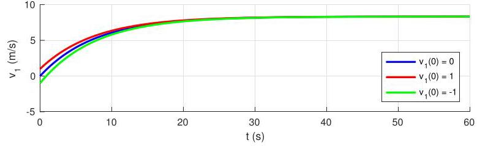

# Solution

## Method
In this case there is a net torque due to the difference between the masses \( {m}_{1} \) and \( {m}_{2} \) . The solution to the first-order differential equation from P2.18 is then

where

\[
\widetilde{\omega } = \operatorname{gr}\frac{{m}_{1} - {m}_{2}}{{b}_{1} + {b}_{2}},\;\lambda  =  - \frac{{b}_{1} + {b}_{2}}{{J}_{1} + {J}_{2} + {r}^{2}\left( {{m}_{1} + {m}_{2}}\right) }.
\]

Substituting the problem data

\[
\widetilde{\omega } \approx  {8.33}\mathrm{{rad}}/\mathrm{s},
\]

\[
\lambda  \approx   - {0.13}{\mathrm{\;s}}^{-1},
\]

As before, we first calculate \( \omega \left( t\right) \) then \( {v}_{1}\left( t\right)  = {r\omega }\left( t\right) \) .

Note that because mass \( {m}_{2} \) is now smaller than mass \( {m}_{1} \) the masses will no longer converge to zero velocities. Without braking, the mass \( {m}_{1} \) would move to the bottom of the elevator.

The responses when \( {v}_{1}\left( 0\right)  = 0,{v}_{1}\left( 0\right)  = 1\mathrm{\;m}/\mathrm{s} \) , and \( {v}_{1}\left( 0\right)  =  - 1\mathrm{\;m}/\mathrm{s} \) should be as in the following plot:

\[
\tau  = \overline{\tau } = \left( {{b}_{1} + {b}_{2}}\right) \overline{\omega } - {gr}\left( {{m}_{1} - {m}_{2}}\right) .
\]

## Teaching Points

1. Unbalanced masses create constant gravitational disturbance
2. First-order systems with constant input converge to nonzero steady states
3. Damping limits velocity but does not stop motion
4. Initial conditions affect transients but not steady-state speed
5. Active control or braking is required to hold position in unbalanced systems
