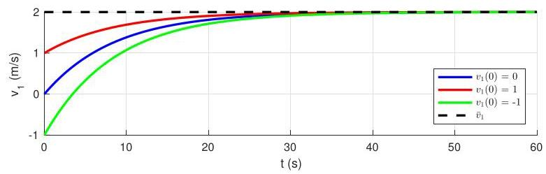

# Solution

## Method

In order to achieve a desired linear speed \( {\bar{v}}_{1} = 2\mathrm{\;m}/\mathrm{s} \) in steady-state we set a desired rotational speed \( \omega  = \overline{\omega } = {\bar{v}}_{1}/r \) and calculate

Substituting the data we obtain

\[
\overline{\tau } = \left( {{b}_{1} + {b}_{2}}\right) \overline{\omega } = {480}\mathrm{\;N}\mathrm{\;m}.
\]

Note that the required torque is relatively small, since \( {m}_{2} = {m}_{1} \) and it only has to overcome friction.

The responses when \( {v}_{1}\left( 0\right)  = 0,{v}_{1}\left( 0\right)  = 1\mathrm{\;m}/\mathrm{s} \) , and \( {v}_{1}\left( 0\right)  =  - 1\mathrm{\;m}/\mathrm{s} \) should be as in the following plot:

## Teaching Points

1. Steady-state velocity is determined by torque–friction balance
2. Balanced systems eliminate gravitational steady disturbances
3. Open-loop constant torque produces predictable steady motion
4. Initial conditions affect only transient behavior
5. Mechanical design choices directly impact control effort
