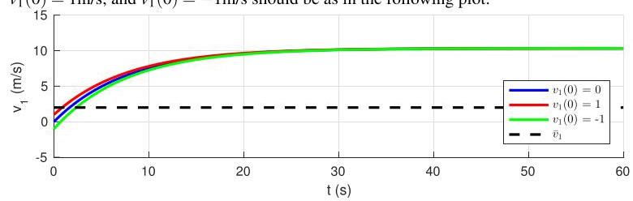
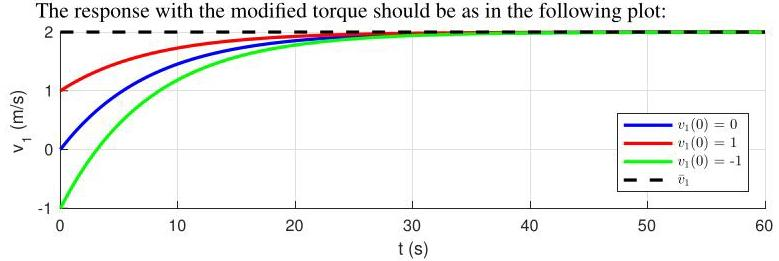

# Solution
=
## Method
 Proceed as in  to show that the responses when \( {m}_{2} = {800}\mathrm{\;{kg}},\tau \) is as in  and \( {v}_{1}\left( 0\right)  = 0 \) , \( {v}_{1}\left( 0\right)  = 1\mathrm{\;m}/\mathrm{s} \) , and \( {v}_{1}\left( 0\right)  =  - 1\mathrm{\;m}/\mathrm{s} \) should be as in the following plot:

Note that the final velocity is no longer the desired velocity \( {\bar{v}}_{1} = 2\mathrm{\;m}/\mathrm{s} \) . In order to achieve a desired speed we need to recalculate

The torque necessary to keep the velocity at \( 1\mathrm{\;m}/\mathrm{s} \) is now a breaking torque since \( {m}_{2} \) is lighter than \( {m}_{1} \) . It is also now much higher when compared to P2.21 since it also has to support the mismatch between the masses \( {m}_{1} \) and \( {m}_{2} \) .

that looks very much like the response obtained  except for a slightly smaller \( \lambda  =  - {0.1304} \) when compared with \( \lambda  =  - {0.1176} \) .

## Teaching Points

1. Open-loop designs are sensitive to parameter mismatch
2. Gravity acts as a constant disturbance in unbalanced systems
3. Achieving steady velocity may require braking torque
4. Mechanical imbalance greatly increases actuator effort
5. Feedback control is necessary for robustness
