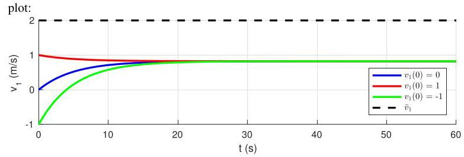

# Solution

## Method
The connection of the model

\[
\left( {{J}_{1} + {J}_{2} + {r}^{2}{m}_{1} + {r}^{2}{m}_{2}}\right) \dot{\omega } + \left( {{b}_{1} + {b}_{2}}\right) \omega  = \tau  + {gr}\left( {{m}_{1} - {m}_{2}}\right)
\]

with the controller

\[
\tau  = K\left( {{\bar{v}}_{1} - {v}_{1}}\right)  = {rK}\left( {\overline{\omega } - \omega }\right)
\]

where \( \overline{\omega } = r{\bar{v}}_{1} \) produces the closed-loop differential equation

\[
\left( {{J}_{1} + {J}_{2} + {r}^{2}{m}_{1} + {r}^{2}{m}_{2}}\right) \dot{\omega } + \left( {{b}_{1} + {b}_{2} + {rK}}\right) \omega  = {rK}\overline{\omega } + {gr}\left( {{m}_{1} - {m}_{2}}\right) .
\]

The solution to this equation is

\[
\omega \left( t\right)  = \widetilde{\omega }\left( {1 - {e}^{\lambda t}}\right)  + \omega \left( 0\right) {e}^{-{\lambda t}},
\]

where

\[
\widetilde{\omega } = \frac{{rK}\overline{\omega } + {gr}\left( {{m}_{1} - {m}_{2}}\right) }{{b}_{1} + {b}_{2} + {rK}},\;\lambda  =  - \frac{{b}_{1} + {b}_{2} + {rK}}{{J}_{1} + {J}_{2} + {r}^{2}\left( {{m}_{1} + {m}_{2}}\right) }.
\]

The closed-loop time-constant is

\[
\tau  =  - {\lambda }^{-1} = \frac{{J}_{1} + {J}_{2} + {r}^{2}\left( {{m}_{1} + {m}_{2}}\right) }{{b}_{1} + {b}_{2} + {rK}}
\]

Be careful not to confuse the time-constant with the torque! We want to select the control gain \( K \) to set \( \tau  = 5\mathrm{\;s} \) .

\[
K = \frac{\left\lbrack  {{J}_{1} + {J}_{2} + {r}^{2}\left( {{m}_{1} + {m}_{2}}\right) }\right\rbrack  /\tau  - \left( {{b}_{1} + {b}_{2}}\right) }{r} \approx  {168}
\]

In open-loop the time-constant is

\[
\tau  =  - {\lambda }^{-1} = \frac{{J}_{1} + {J}_{2} + {r}^{2}\left( {{m}_{1} + {m}_{2}}\right) }{{b}_{1} + {b}_{2}} \approx  {8.5}\mathrm{\;s}
\]

The steady state error is

\[
{\bar{v}}_{1} - {\widetilde{v}}_{1} = r\left( {\overline{\omega } - \widetilde{\omega }}\right)
\]

\[
= r\left( {\overline{\omega } - \frac{{rK}\overline{\omega } + {gr}\left( {{m}_{1} - {m}_{2}}\right) }{{b}_{1} + {b}_{2} + {rK}}}\right)
\]

\[
= r\frac{\left( {{b}_{1} + {b}_{2}}\right) \overline{\omega } - {gr}\left( {{m}_{1} - {m}_{2}}\right) }{{b}_{1} + {b}_{2} + {rK}}
\]

\[
= r\frac{1}{1 + {rK}/\left( {{b}_{1} + {b}_{2}}\right) }\overline{\omega } - g{r}^{2}\frac{\left( {{m}_{1} - {m}_{2}}\right) /\left( {{b}_{1} + {b}_{2}}\right) }{1 + {rK}/\left( {{b}_{1} + {b}_{2}}\right) }
\]

Substituting the data

\[
{\bar{v}}_{1} - {\widetilde{v}}_{1} \approx  {1.18}\mathrm{\;m}/\mathrm{s}
\]

The closed-responses when \( {v}_{1}\left( 0\right)  = 0,{v}_{1}\left( 0\right)  = 1\mathrm{\;m}/\mathrm{s} \) , and \( {v}_{1}\left( 0\right)  =  - 1\mathrm{\;m}/\mathrm{s} \) should be as in the following

## Teaching Points

1. Proportional control improves transient response
2. Time constants can be shaped by feedback gain
3. Constant disturbances cause steady-state error
4. Feedback improves robustness but has limits
5. Integral action is required for perfect tracking
