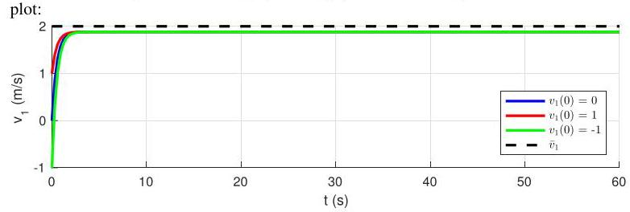

# Solution

## Method
The solution is \( \tau  = {0.5}\mathrm{\;s} \) . The relevant quantities are:

\[
K \approx  {3840},
\]

\[
\tau  \approx  {8.5}\mathrm{\;s}\;\text{ (open-loop), }
\]

\[
{\bar{v}}_{1} - {\widetilde{v}}_{1} \approx  {0.12}\mathrm{\;m}/\mathrm{s}
\]

Note how high the gain is. This high gain will produce high closed-loop torques that the motors might have trouble delivering.

The closed-responses when \( {v}_{1}\left( 0\right)  = 0,{v}_{1}\left( 0\right)  = 1\mathrm{\;m}/\mathrm{s} \) , and \( {v}_{1}\left( 0\right)  =  - 1\mathrm{\;m}/\mathrm{s} \) should be as in the following

## Teaching Insight

This problem highlights why control design must balance mathematical performance with physical realizability and robustness.
