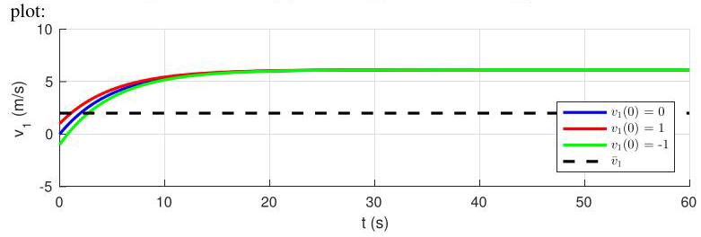

# Solution

## Method
Using the data from P2.23 and \( {m}_{2} = {800}\mathrm{\;{kg}} \) we recalculate the control gain

\[
K = \frac{\left\lbrack  {{J}_{1} + {J}_{2} + {r}^{2}\left( {{m}_{1} + {m}_{2}}\right) }\right\rbrack  /\tau  - \left( {{b}_{1} + {b}_{2}}\right) }{r} \approx  {128}
\]

and the steady state error

\[
{\bar{v}}_{1} - {\widetilde{v}}_{1} = r\frac{1}{1 + {rK}/\left( {{b}_{1} + {b}_{2}}\right) }\overline{\omega } - g{r}^{2}\frac{\left( {{m}_{1} - {m}_{2}}\right) /\left( {{b}_{1} + {b}_{2}}\right) }{1 + {rK}/\left( {{b}_{1} + {b}_{2}}\right) } \approx   - {4.13}\mathrm{\;m}/\mathrm{s}.
\]

The open-loop time-constant is

\[
\tau  =  - {\lambda }^{-1} = \frac{{J}_{1} + {J}_{2} + {r}^{2}\left( {{m}_{1} + {m}_{2}}\right) }{{b}_{1} + {b}_{2}} \approx  {7.67}\mathrm{\;s}
\]

The closed-responses when \( {v}_{1}\left( 0\right)  = 0,{v}_{1}\left( 0\right)  = 1\mathrm{\;m}/\mathrm{s} \) , and \( {v}_{1}\left( 0\right)  =  - 1\mathrm{\;m}/\mathrm{s} \) should be as in the following

## Teaching Points

- Constant disturbances cannot be rejected by proportional control alone.
- Disturbance sensitivity is a key limitation of low-order controllers.
- Time-domain performance and steady-state accuracy must be considered jointly.
- This problem motivates PI and PID control strategies.
