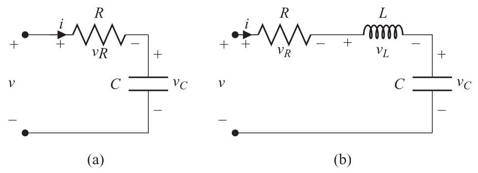

# Problem: Differential Equation Modeling of an RC Circuit

## Problem Description
An electric circuit in which a capacitor is in series with a resistor is shown in Fig. 2.22(a). In an electric circuit, the sum of the voltages around a loop must equal

Figure 2.22 

zero:

\[
-v + {v}_{R} + {v}_{C} = 0.
\]

This is Kirchhoff's voltage law. The voltage and the current on the capacitor and resistor satisfy

\[
{i}_{C} = C\dot{{v}_{C}},\;{v}_{R} = R{i}_{R},
\]

where \( C \) is the capacitor’s capacitance and \( R \) is the resistor’s resistance. In this circuit

\[
{i}_{R} = {i}_{C} = i
\]

because all elements are in series. This is Kirchhoff's current law. Show that

\[
{RC}{\dot{v}}_{C} + {v}_{C} = v
\]

is the equation governing this \( {RC} \) -circuit.

---

## Subproblems

1. Apply Kirchhoff’s voltage law to the circuit loop.
2. Express the resistor voltage in terms of the circuit current.
3. Express the capacitor current in terms of the capacitor voltage.
4. Use Kirchhoff’s current law to relate the currents.
5. Derive the governing differential equation for \( v_C(t) \).
6. Interpret the resulting equation physically.

---

## Additional Information

- The voltage source \( v(t) \) is assumed to be known.
- All circuit elements are linear and ideal.
- The circuit contains a single energy storage element
