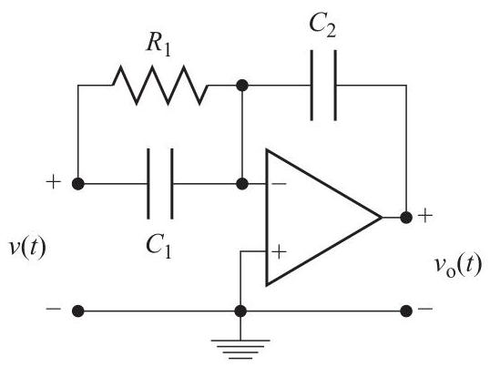

# Problem

## Problem Description
An approximate model for the electric circuit in Fig. 2.23, where the triangular element is an amplifier with a very large gain (operational amplifier, OpAmp), is obtained from

\[
{R}_{1}{i}_{{R}_{1}} = v - {v}_{ - },\;{i}_{{C}_{1}} = {C}_{1}\left( {\dot{v} - {\dot{v}}_{ - }}\right) ,\;{i}_{{C}_{2}} = {C}_{2}\left( {{\dot{v}}_{ - } - {\dot{v}}_{0}}\right) ,
\]

and

\[
{v}_{ - } \approx  {v}_{ + } = 0,\;{i}_{{C}_{2}} = {i}_{{C}_{1}} + {i}_{{R}_{1}}.
\]

Show that

\[
{R}_{1}{C}_{2}{\dot{v}}_{0} + {R}_{1}{C}_{1}\dot{v} + v = 0.
\]

Solve the auxiliary differential equation:

\[
\dot{z} + \frac{1}{{R}_{1}{C}_{2}}v = 0
\]

and show that

\[
{v}_{0}\left( t\right)  = {R}_{1}{C}_{1}\dot{z}\left( t\right)  + z\left( t\right)
\]

solves the original differential equation.

Figure 2.23 Diagram for P2.38.

## Subproblems

1. Using the given equations and the ideal Op-Amp approximation, derive a single differential equation relating \( v(t) \) and \( v_0(t) \).
2. Show that the system dynamics can be written in the form:
   \[
   R_1 C_2 \dot{v}_0 + R_1 C_1 \dot{v} + v = 0
   \]
3. Consider the auxiliary differential equation:
   \[
   \dot{z} + \frac{1}{R_1 C_2} v = 0
   \]
   Solve for \( z(t) \) in terms of \( v(t) \).
4. Show that defining
   \[
   v_0(t) = R_1 C_1 \dot{z}(t) + z(t)
   \]
   yields a solution that satisfies the original circuit differential equation.

## Additional Information

- The operational amplifier is assumed to have infinite gain.
- Capacitors are ideal and linear.
- Initial conditions may be represented symbolically.
- The input voltage \( v(t) \) is assumed to be a smooth function of time.

---

## Constraints

- All derivations must be shown explicitly.
- Use time-domain differential equations only.
- Clearly state all modeling assumptions.
- Do not introduce Laplace transforms or frequency-domain analysis.
