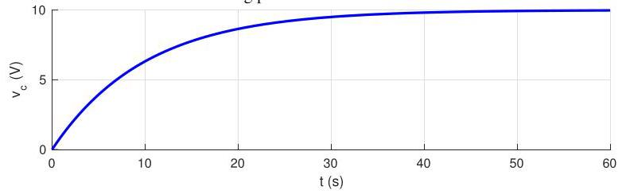
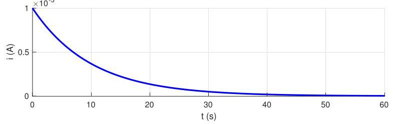

# Solution

## Method 
The solution to the differential equation when \( v\left( t\right)  = \bar{v} \) is constant and under the assumption of zero initial conditions is

\[
{v}_{C}\left( t\right)  = \widetilde{v}\left( t\right) \left( {1 - {e}^{\lambda t}}\right)
\]

where

\[
\lambda  =  - \frac{1}{RC} =  - \frac{1}{1 \times  {10}^{6} \times  {10} \times  {10}^{-6}} =  - {0.1}{\mathrm{\;s}}^{-1},\;\widetilde{v} = \bar{v} = {10}\mathrm{\;V}
\]

which should be as in the following plot:

The current

\[
i\left( t\right)  = {i}_{C}\left( t\right)  = C{\dot{v}}_{C}\left( t\right)  =  - \frac{C\widetilde{v}}{\lambda }{e}^{\lambda t},\; - \frac{C\widetilde{v}}{\lambda } = \frac{{10} \times  {10}^{-6} \times  {10}}{0.1} = 1\mathrm{\;{mA}}.
\]

which should be as in the following plot:

## Teaching Points

1. The capacitor initially behaves like a short circuit.
2. As charge accumulates, the current decreases.
3. The capacitor voltage asymptotically approaches the supply voltage.
4. The circuit exhibits classic first-order step response behavior.
5. The time constant \( RC \) governs the speed of the response.
