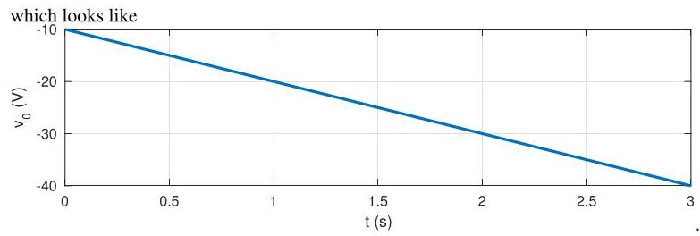

# Solution

## Met
With a constant voltage \( v\left( t\right)  = {10}\mathrm{\;V} \) and zero initial conditions the response looks like

\[
{v}_{o}\left( t\right)  =  - \frac{{C}_{1}}{{C}_{2}}v\left( t\right)  - \frac{1}{{R}_{1}{C}_{2}}{\int }_{0}^{t}v\left( \tau \right) {d\tau }
\]

\[
=  - {10} - {10}{\int }_{0}^{t}{d\tau } =  - {10}\left( {1 + t}\right) ,
\]

\[
{v}_{o}\left( t\right)  = z\left( t\right)  = z\left( 0\right)  - \frac{1}{{R}_{1}{C}_{2}}{\int }_{0}^{t}v\left( \tau \right) {d\tau }.
\]

## Teaching Points

1. Constant inputs lead to ramp outputs in integrator-like circuits
2. Equal capacitor values simplify system dynamics
3. Zero initial conditions eliminate transient offsets
4. Op-Amp RC circuits can implement proportional–integral behavior
5. Linear growth indicates absence of internal damping
