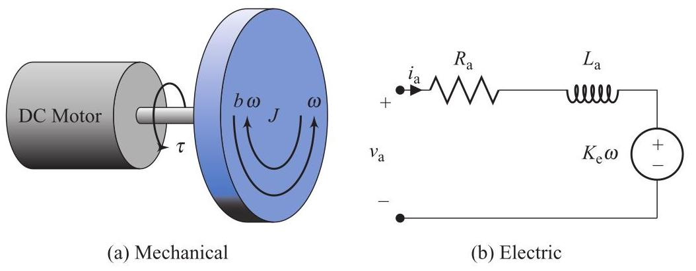

# Problem

## Problem Description
The mechanical motion of the rotor of a DC motor shown schematically in Fig. 2.24(a) can be described by the differential equation

\[
J\dot{\omega } + {b\omega } = \tau ,
\]

where \( \omega \) is the rotor angular speed, \( J \) is the rotor moment of inertia, \( b \) is the coefficient of viscous friction. The rotor torque, \( \tau \) , is given by

\[
\tau  = {K}_{\mathrm{t}}{i}_{\mathrm{a}}
\]

where \( {i}_{\mathrm{a}} \) is the armature current and \( {K}_{\mathrm{t}} \) is the motor torque constant. Neglecting the effects of the armature inductance \( \left( {{L}_{\mathrm{a}} \approx  0}\right) \) , the current is determined by the circuit in Fig. 2.24(b):

\[
{v}_{\mathrm{a}} = {R}_{\mathrm{a}}{i}_{\mathrm{a}} + {K}_{\mathrm{e}}\omega ,
\]

where \( {v}_{\mathrm{a}} \) is the armature voltage, \( {R}_{\mathrm{a}} \) is the armature resistance, and \( {K}_{\mathrm{e}} \) is the back-EMF constant. Combine these equations to show that

\[
J\dot{\omega } + \left( {b + \frac{{K}_{\mathrm{e}}{K}_{\mathrm{t}}}{{R}_{\mathrm{a}}}}\right) \omega  = \frac{{K}_{\mathrm{t}}}{{R}_{\mathrm{a}}}{v}_{\mathrm{a}}.
\]

Figure 2.24 
## Subproblems

1. Solve the armature circuit equation for the armature current \( i_a \).
2. Substitute the expression for \( i_a \) into the mechanical equation.
3. Derive a single differential equation relating \( \omega \) and the input voltage \( v_a \).
4. Identify the effective damping term introduced by the electrical subsystem.
5. Interpret the physical meaning of the additional damping.

---

## Additional Information

- The DC motor is assumed to operate in the linear region.
- Magnetic saturation effects are neglected.
- The back-EMF is proportional to angular speed.
- All parameters are constant and positive.

---

## Constraints

- Use time-domain differential equations only.
- Do not use Laplace transforms.
- Show all algebraic steps clearly.
- Clearly identify mechanical and electrical contributions.
