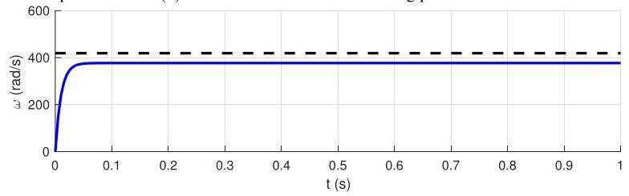
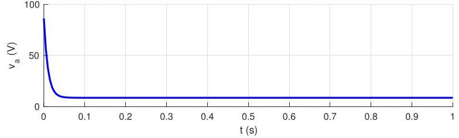

# Solution

## Method
you calculated the model

\[
\dot{\omega } + {\alpha \omega } = \beta {v}_{a},\;\alpha  = {10}{\mathrm{\;s}}^{-1},\;\beta  \approx  {436.3}\mathrm{{rad}}/\left( {\mathrm{V}{\mathrm{s}}^{2}}\right)
\]

The closed-loop connection of this model with the controller produces the differential equation:

\[
\dot{\omega } + \left( {\alpha  + {K\beta }}\right) \omega  = {K\beta }\overline{\omega }
\]

Its solution is

\[
\omega \left( t\right)  = \widetilde{\omega }\left( {1 - {e}^{\lambda t}}\right)  + \omega \left( 0\right) {e}^{\lambda t}
\]

where

\[
\lambda  =  - \left( {\alpha  + {K\beta }}\right) ,\;\widetilde{\omega } = \frac{{K\beta }\overline{\omega }}{\alpha  + {K\beta }}.
\]

For \( \overline{\omega } = \left( {{2\pi }/{60}}\right) {4000} \approx  {418.9}\mathrm{{rad}}/\mathrm{s} \) the steady-state error is

\[
\overline{\omega } - \widetilde{\omega } = \overline{\omega } - \frac{{K\beta }\overline{\omega }}{\alpha  + {K\beta }} = \frac{\alpha \overline{\omega }}{\alpha  + {K\beta }}
\]

In order to obtain

\[
\frac{\left| \overline{\omega } - \widetilde{\omega }\right| }{\left| \overline{\omega }\right| } = \frac{\left| \alpha \right| }{\left| \alpha  + K\beta \right| } \leq  {0.1}
\]

we must select

\[
K \geq  \frac{9\alpha }{\beta } \approx  {0.2}
\]

The closed-loop time-constant corresponding to \( K = {0.2} \) is

\[
\tau  = \frac{1}{\alpha  + {K\beta }} \approx  {0.01}\mathrm{\;s}
\]

The response when \( \omega \left( 0\right)  = 0 \) should be as in the following plot:

\[
{v}_{a}\left( 0\right)  = K\overline{\omega } \leq  {12}
\]

The maximum value of \( {v}_{a}\left( t\right) \) is at \( t = 0 \) which is

\[
{v}_{a}\left( 0\right)  = K\left( {\overline{\omega } - \omega \left( 0\right) }\right)  = K\overline{\omega } \approx  {86.4}\mathrm{\;V}.
\]

## Teaching Points

1. Proportional feedback reduces steady-state error but does not eliminate it.
2. Increasing controller gain improves accuracy at the cost
