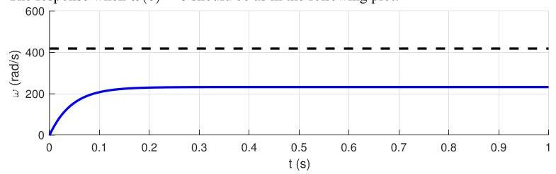
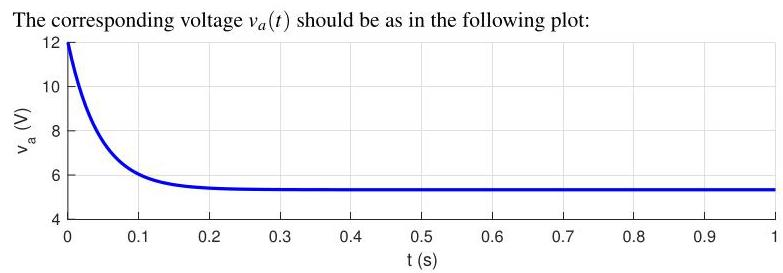

# Solution

## Method

We proceed as in P2.47 but this time we select \( K \) such that

when \( \overline{\omega } = \left( {{2\pi }/{60}}\right) {4000} \approx  {418.9}\mathrm{{rad}}/\mathrm{s} \)

\[
K \leq  \frac{12}{\overline{\omega }} \approx  {0.029}
\]

The time-constant corresponding to \( K = {0.029} \) is

\[
\tau  = \frac{1}{\alpha  + {K\beta }} \approx  {0.044}\mathrm{\;s}
\]

The response when \( \omega \left( 0\right)  = 0 \) should be as in the following plot:

\[
{mc}\dot{T} + \left( {{wc} + \frac{1}{R}}\right) T = q + {wc}{T}_{i} + \frac{1}{R}{T}_{o}.
\]

which, as expected has a maximum voltage \( {v}_{a}\left( 0\right)  = {12}\mathrm{\;V} \) . Note that the closed-loop response is now slower.

## Teaching Points

1. Actuator limits impose fundamental constraints on controller design.
2. Proportional gain directly determines initial control effort.
3. Lower gain increases the closed-loop time constant.
4. There is a trade-off between response speed and actuator safety.
5. Practical controller design must respect hardware limitations.
