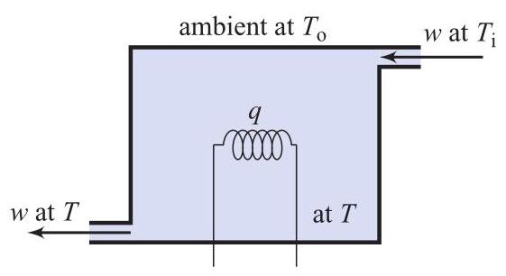

# Problem: Temperature Dynamics of a Flowing Substance in a Container

## Problem Description
The temperature, \( T \) (in \( \mathrm{K} \) or in \( {}^{ \circ  }\mathrm{C} \) ), of a substance flowing in and out of a container kept at the ambient temperature, \( {T}_{0} \) , with an inflow temperature, \( {T}_{\mathrm{i}} \) , and a heat source, \( q \) (in W), can be approximated by the differential equation

\[
{mc}\dot{T} = q + {wc}\left( {{T}_{\mathrm{i}} - T}\right)  + \frac{1}{R}\left( {{T}_{\mathrm{o}} - T}\right) ,
\]

where \( m \) and \( c \) are the substance’s mass and specific heat, and \( R \) is the overall system’s thermal resistance. The input and output flow mass rates are assumed to be equal to \( w \) . This differential equation model can be seen as a dynamic system where the output is the substance’s temperature, \( T \) , and the inputs are the heat source, \( q \) , the flow rate, \( w \) , and the temperatures \( {T}_{\mathrm{o}} \) and \( {T}_{\mathrm{i}} \) . Calculate the solution to this equation when \( q, w,{T}_{\mathrm{o}} \) , and \( {T}_{\mathrm{i}} \) are constants.

Figure 2.25 Diagram for P2.49.

## Subproblems

1. Rewrite the temperature dynamics in standard first-order linear system form.
2. Identify the system time constant and steady-state temperature.
3. Solve the differential equation assuming all inputs are constants.
4. Describe the transient and steady-state behavior of the temperature.
5. Interpret the physical meaning of each term in the model.

---

## Additional Information

- All parameters are positive constants.
- Temperature may be expressed in Kelvin or degrees Celsius.
- The system can be modeled as a lumped thermal system.
- Initial temperature \( T(0) \) is known.

---

## Constraints

- Assume perfect mixing inside the container.
- Neglect spatial temperature variations.
- All derivations must be shown.
- Use consistent physical units.
