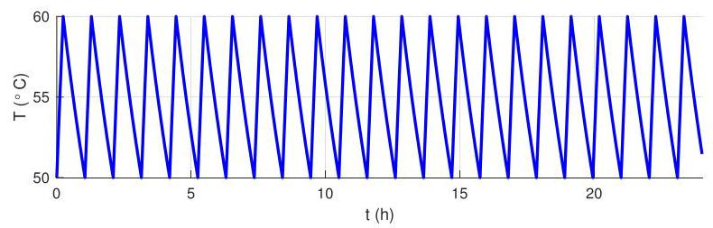

# Solution

## Method

We solve the problem by considering two phases: a) after the heater is turned on at \( T = \underline{T} = {50}^{ \circ  }\mathrm{C} \) until it is turned off at \( T = \bar{T} = {60}^{ \circ  }\mathrm{C} \) ; b) after the heater is turned off at \( T = \bar{T} = {60}^{ \circ  }\mathrm{C} \) until it is turned on at \( T = \underline{T} = {50}^{ \circ  }\mathrm{C} \) .

In the first phase, \( q = {12}\mathrm{\;{kW}}, w = {21} \times  {10}^{-6}{\mathrm{\;m}}^{3}/\mathrm{s}, T\left( 0\right)  = \underline{T} \) and

\[
{mc}\dot{T} + \left( {{wc} + \frac{1}{R}}\right) T = q + {wc}{T}_{i} + \frac{1}{R}{T}_{o}.
\]

which has as solution

\[
T\left( t\right)  = {\widetilde{T}}_{1}\left( {1 - {e}^{\lambda t}}\right)  + \underline{T}{e}^{\lambda t}
\]

where

\[
\lambda  =  - \frac{{Rwc} + 1}{Rmc} \approx   - {115.3} \times  {10}^{-6}{\mathrm{\;s}}^{-1}
\]

and

\[
{\widetilde{T}}_{1} = \frac{Rq}{{Rwc} + 1} + \frac{{Rwc}{T}_{i} + {T}_{o}}{{Rwc} + 1} \approx  {156.4}^{ \circ  }\mathrm{C}
\]

The heater stays in this phase for

\[
{t}_{1} = \frac{1}{\lambda }\log \frac{\bar{T} - {\widetilde{T}}_{1}}{\underline{T} - {\widetilde{T}}_{1}} \approx  {857}\mathrm{\;s}
\]

or about 14 minutes. The average temperature in this phase is

\[
{T}_{1} = \frac{1}{{t}_{1}}{\int }_{0}^{{t}_{1}}T\left( \tau \right) {d\tau } = {\int }_{0}^{{t}_{1}}{\widetilde{T}}_{1} + \left( {\underline{T} - {\widetilde{T}}_{1}}\right) {e}^{\lambda \tau }{d\tau } = {\widetilde{T}}_{1} + \frac{\underline{T} - {\widetilde{T}}_{1}}{\lambda {t}_{1}}\left( {{e}^{\lambda {t}_{1}} - 1}\right)  \approx  {55.1}^{ \circ  }\mathrm{C}.
\]

In the second phase, \( q = 0, w = {21} \times  {10}^{-6}{\mathrm{\;m}}^{3}/\mathrm{s}, T\left( 0\right)  = \bar{T} \) and

\[
{mc}\dot{T} + \left( {{wc} + \frac{1}{R}}\right) T = {wc}{T}_{i} + \frac{1}{R}{T}_{o}.
\]

which has as solution

\[
T\left( t\right)  = {\widetilde{T}}_{2}\left( {1 - {e}^{\lambda t}}\right)  + \bar{T}{e}^{\lambda t}
\]

where \( \lambda \) is as before and

\[
{\widetilde{T}}_{2} = {T}_{i} = {T}_{o} \approx  {25}^{ \circ  }\mathrm{C}.
\]

The heater stays in this phase for

\[
{t}_{2} = \frac{1}{\lambda }\log \frac{\underline{T} - {\widetilde{T}}_{2}}{\bar{T} - {\widetilde{T}}_{2}} \approx  {2921}\mathrm{\;s}
\]

or about 48 minutes. The average temperature in this phase is

\[
{T}_{2} = \frac{1}{{t}_{2}}{\int }_{0}^{{t}_{1}}T\left( \tau \right) {d\tau } = {\int }_{0}^{{t}_{2}}{\widetilde{T}}_{2} + \left( {\bar{T} - {\widetilde{T}}_{2}}\right) {e}^{\lambda \tau }{d\tau } = {\widetilde{T}}_{2} + \frac{\bar{T} - {\widetilde{T}}_{2}}{\lambda {t}_{2}}\left( {{e}^{\lambda {t}_{1}} - 1}\right)  \approx  {54.7}^{ \circ  }\mathrm{C}.
\]

The temperature of the water during 24 hours looks like in the plot:

\[
T = \frac{{t}_{1}{T}_{1} + {t}_{2}{T}_{2}}{{t}_{1} + {t}_{2}} \approx  {54.8}^{ \circ  }\mathrm{C}.
\]

During one complete on/off cycle the average temperature is

The average power consumption was

\[
P = \frac{{t}_{1}q}{{t}_{1} + {t}_{2}} \approx  {2723}\mathrm{\;W}
\]

since power is only consumed in phase 1.

This is more than 20 times the amount consumed when there was no flow.

## Teaching Points
