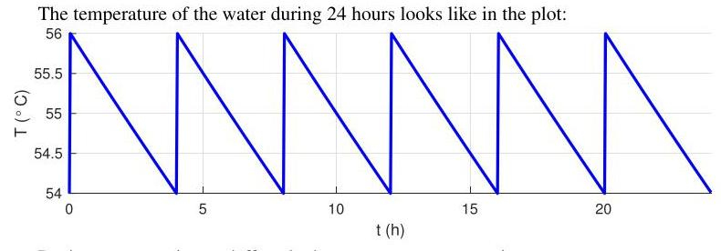

# Solution

## Method

Key quantities in the first phase are:

\[
\lambda  =  - \frac{1}{Rmc} \approx   - {4.67} \times  {10}^{-6}{\mathrm{\;s}}^{-1},
\]

\[
{\widetilde{T}}_{1} = {Rq} + \frac{{Rwc}{T}_{i} + {T}_{o}}{{Rwc} + 1} \approx  {3265}^{ \circ  }\mathrm{C},
\]

\[
{t}_{1} = \frac{1}{\lambda }\log \frac{\bar{T} - {\widetilde{T}}_{1}}{\underline{T} - {\widetilde{T}}_{1}} \approx  {133}\mathrm{\;s},
\]

\[
{T}_{1} = {\widetilde{T}}_{1} + \frac{\underline{T} - {\widetilde{T}}_{1}}{\lambda {t}_{1}}\left( {{e}^{\lambda {t}_{1}} - 1}\right)  \approx  {55.0}^{ \circ  }\mathrm{C}.
\]

In the second phase:

\[
{\widetilde{T}}_{2} = {T}_{i} = {T}_{o} \approx  {25}^{ \circ  }\mathrm{C},
\]

\[
{t}_{2} = \frac{1}{\lambda }\log \frac{T - {\widetilde{T}}_{2}}{\bar{T} - {\widetilde{T}}_{2}} \approx  {14280}\mathrm{\;s},
\]

\[
{T}_{2} = {\widetilde{T}}_{2} + \frac{\bar{T} - {\widetilde{T}}_{2}}{\lambda {t}_{2}}\left( {{e}^{\lambda {t}_{1}} - 1}\right)  \approx  {55.0}^{ \circ  }\mathrm{C}.
\]

\[
T = \frac{{t}_{1}{T}_{1} + {t}_{2}{T}_{2}}{{t}_{1} + {t}_{2}} \approx  {55.0}^{ \circ  }\mathrm{C}.
\]

The average power consumption is:

\[
P = \frac{{t}_{1}q}{{t}_{1} + {t}_{2}} \approx  {111}\mathrm{\;W}
\]

the temperature is better regulated and there is a slight increase in the consumed power. Note how the number of cycles has increased since both \( {t}_{1} \) and \( {t}_{2} \) got smaller.
