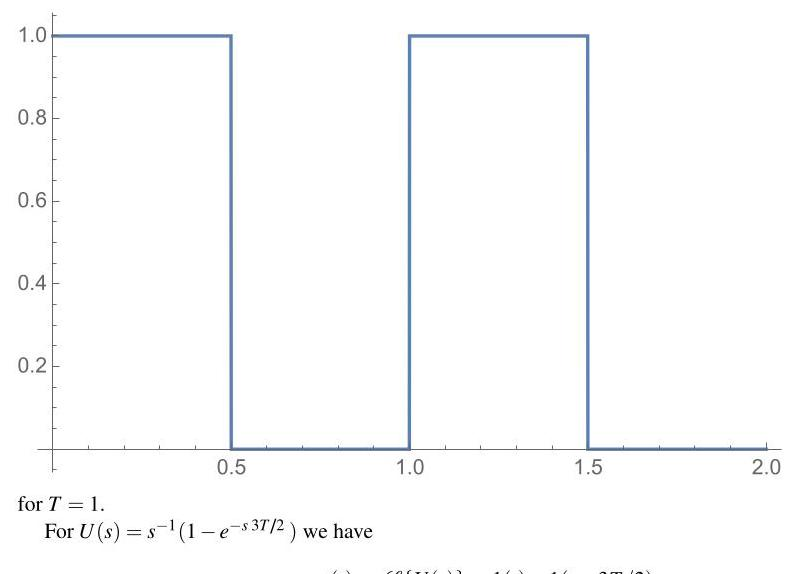
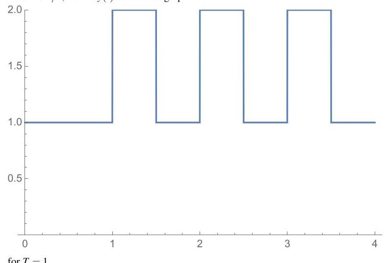

# Solution

## Method

Use the hint to write

\[
Y\left( s\right)  = \frac{U\left( s\right) }{1 - {e}^{-{sT}}} = \mathop{\sum }\limits_{{k = 0}}^{\infty }U\left( s\right) {e}^{-{skT}}
\]

for all \( s \) such that \( \left| {e}^{-{sT}}\right|  < 1 \) . Because \( u\left( t\right)  = 0 \) for all \( t \geq  T > 0 \) then \( U\left( s\right) \) is entire and converge everywhere (see P3.43). Therefore

\[
\mathcal{L}\{ Y\left( s\right) \}  = \mathop{\sum }\limits_{{k = 0}}^{\infty }{\mathcal{L}}^{-1}\left\{  {U\left( s\right) {e}^{-{skT}}}\right\}   = \mathop{\sum }\limits_{{k = 0}}^{\infty }u\left( {t - {kT}}\right)
\]

which is periodic with period \( T \) .

For \( U\left( s\right)  = {s}^{-1}\left( {1 - {e}^{-{sT}/2}}\right) \) we have

\[
u\left( t\right)  = \mathcal{L}\{ U\left( s\right) \}  = 1\left( t\right)  - 1\left( {t - T/2}\right)
\]

so that \( y\left( t\right) \) is a square wave of period \( T \) with \( u\left( t\right)  = 1 \) for \( 0 < t < T/2 \) and \( u\left( t\right)  = 0 \) for \( T/2 < t < T \) as in the graph:

\( u\left( t\right)  = \mathcal{L}\{ U\left( s\right) \}  = 1\left( t\right)  - 1\left( {t - {3T}/2}\right) \)

In this case, because \( u\left( t\right) \) is nonzero for \( t > T \) the contribution of consecutive periods overlap, starting at \( T < t < T/2 \) , so that \( y\left( t\right) \) is as in the graph:

## Teaching Points
1. Replication in the Laplace domain corresponds to time-domain periodic extension
2. Finite support of the base signal is essential for strict periodicity
3. Overlapping shifted signals destroy simple periodic structure
4. Step functions provide a powerful tool for constructing piecewise signals
5. Geometric series expansions are central in analyzing sampled and periodic systems
