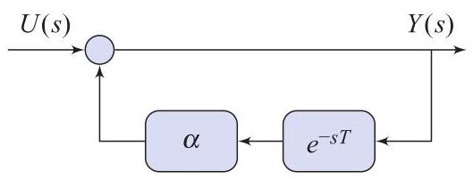

# Problem

## Problem Description

Calculate \( Y\left( s\right) \) and the associated transfer-function in the block-diagram in Fig. 3.5. Compare with P3.48. Is this system asymptotically stable?

Figure 3.5

## Subproblems
1. Derive the algebraic expression for $Y(s)$ in terms of $U(s)$, $\alpha$, and the delay term $e^{-sT}$.
2. Identify the system transfer function $G(s)$.
3. Express the output in the time domain $y(t)$ as a series involving shifted versions of the input $u(t)$.
4. Determine the impulse response $g(t)$ and use the stability criterion $\int_{0^{-}}^{\infty} |g(t)| dt$ to find the condition for asymptotic stability.

## Additional Information
- The term $e^{-sT}$ represents a pure time delay of $T$ seconds in the Laplace domain.
- Recall the geometric series expansion: $\frac{1}{1-x} = \sum_{k=0}^{\infty} x^k$ for $|x| < 1$.
- The system is asymptotically stable if the impulse response is absolutely integrable.

## Constraints
- All steps of the derivation must be clearly shown.
- The stability analysis must specifically address the magnitude of the parameter $\alpha$.
- Use the properties of the Laplace transform, specifically the time-shifting theorem.