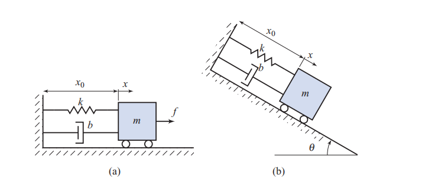

# Problem

## Problem Description
You have shown that the ordinary differential equation

\[
m\ddot{x} + b\dot{x} + {kx} = f
\]

is a simplified description of the motion of the mass-spring-damper system in Fig. 2.19(a), where \( x \) is the position of the mass, \( m \) , and \( f \) is a force applied on the mass. Calculate the transfer-function from the force \( f \) to the mass position \( x \) . Assume that all constants are positive. Is this transfer-function asymptotically stable?

Fig. 2.19
## Subproblems
1. State the assumptions required to apply the Laplace transform to the system equation.
2. Apply the Laplace transform to the differential equation under zero initial conditions.
3. Solve for the ratio \( X(s)/F(s) \).
4. Express the transfer function in standard second-order system form.
5. Identify the natural frequency and damping ratio.
6. Determine the poles of the transfer function.
7. Analyze the asymptotic stability based on pole locations.
8. Interpret the physical meaning of the damping ratio.

## Additional Information
- The system is linear and time-invariant.
- Zero initial conditions are assumed.
- All parameters \( m, b, k \) are strictly positive.
- Standard results for second-order systems may be used.
- Stability is determined by pole locations in the complex plane.

## Constraints
- Do not introduce nonlinear effects.
- Use Laplace-domain methods consistently.
- Express results in physically interpretable parameters.
- Clearly justify the stability conclusion.
