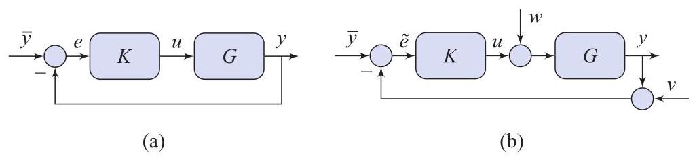

# Problem

## Problem Description

Consider the standard feedback connection in Fig. 4.20(a) in which the system and controller transfer-functions are

\[
G(s) = \frac{1}{s}, \; K(s) = 1.
\]

Is the closed-loop system internally stable? Does the closed-loop system achieve asymptotic tracking of a constant input \( y(t) = \bar{y}, t \geq 0 \)?

## Subproblems

1. Write the loop transfer function \( GK \) and identify its poles and zeros.
2. Derive the sensitivity function \( S(s) = \frac{1}{1 + GK} \).
3. Determine the pole locations of \( S(s) \) and assess its stability.
4. Use the sensitivity function to analyze internal stability of the closed-loop system.
5. Examine the behavior of the closed-loop system in response to a constant reference input.
6. Explain the role of poles at the origin and zeros at the origin in steady-state tracking.

## Additional Information

- The feedback configuration is assumed to be unity feedback.
- All systems are linear and time-invariant.
- No pole-zero cancellations occur in the open-loop transfer function.
- Stability is assessed in the sense of asymptotic (BIBO) stability.

## Constraints

- Use frequency-domain and transfer-function analysis only.
- Do not rely on time-domain simulation.
- Clearly distinguish between internal stability and tracking performance.
- All conclusions must be justified analytically.
