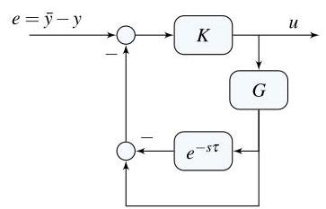
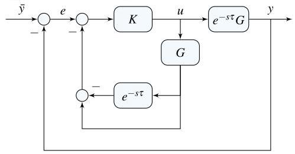

# Solution

## Method

Follow the diagram to write:

\[
u = K\left( \bar{y} - \left( y - e^{-s\tau} Gu \right) - Gu \right)
\]

\[
= K(\bar{y} - y) - (1 - e^{-s\tau}) GKu
\]

Solving for \( u \):

\[
u
= \frac{K}{1 + (1 - e^{-s\tau}) GK} (\bar{y} - y)
= \widehat{K}(\bar{y} - y).
\]

A possible block-diagram for the controller is:

which allows one to rearrange the closed-loop diagram as:

## Teaching Points

1. Separation of delay and delay-free dynamics
2. Algebraic block-diagram manipulation
3. Concept of internal plant models in control
4. Delay compensation using Smith predictors
5. Structural interpretation of feedback loops
