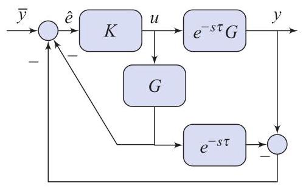

# Problem

## Problem Description

Show that the transfer-function from \( \bar{y} \) to \( \widehat{e} \) is

\[
\widehat{S} = \left( 1 + GK \right)^{-1}
\]

and that from \( \bar{y} \) to \( e = \bar{y} - y \) is

\[
S = \left( 1 + \left( 1 - e^{-s\tau} \right) GK \right) \left( 1 + GK \right)^{-1}.
\]

Assuming that \( G \) is asymptotically stable, explain how to select \( K \) so that the closed-loop connection in Fig. 4.21 is internally stable.

Figure 4.21
## Subproblems

1. Write the signal equations relating \( \widehat{e} \), \( y \), and \( u \).
2. Derive the transfer-function from \( \bar{y} \) to \( \widehat{e} \).
3. Derive the transfer-function from \( \bar{y} \) to the tracking error \( e \).
4. Simplify the resulting expressions using algebraic manipulation.
5. Analyze the poles of \( \widehat{S} \) and \( S \).
6. Explain how controller \( K \) should be selected to guarantee internal stability.

## Additional Information

- The system configuration corresponds to the Smith predictor structure in Fig. 4.21.
- The delayed plant is represented by \( e^{-s\tau} G \).
- The controller \( \widehat{K} \) is defined as
  \[
  \widehat{K} = \frac{K}{1 + (1 - e^{-s\tau}) GK}.
  \]
- Internal stability requires stability of all internal closed-loop transfer functions.

## Constraints

- Use frequency-domain transfer-function analysis.
- Do not rely on time-delay approximations.
- Internal stability must be justified analytically.
- Assume exact knowledge of the plant \( G \).
