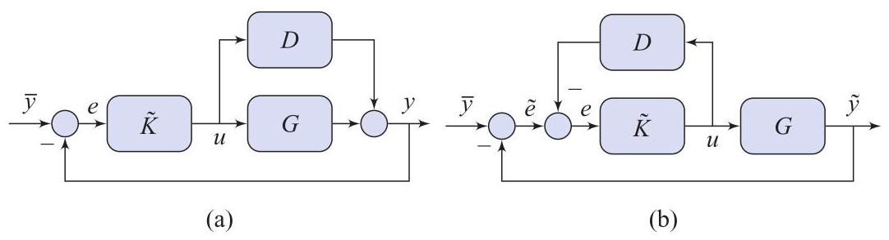

# Problem

## Problem Description

Show that the block-diagrams in Fig. 4.22 have the same transfer-function from \( \bar{y} \) to \( e \):

\[
S = \frac{1}{1 + \widetilde{K}(G + D)},
\]

and that

\[
K = \frac{\widetilde{K}}{1 + \widetilde{K}D}
\]

is the transfer-function from \( \widetilde{e} \) to \( u \) in Fig. 4.22(b).

Figure 4.22 Diagrams for P4.15.

## Subproblems

1. Write the signal equations for the block-diagram in Fig. 4.22(a).
2. Derive the sensitivity function \( S \) from \( \bar{y} \) to \( e \) for Fig. 4.22(a).
3. Write the signal equations for the block-diagram in Fig. 4.22(b).
4. Show that the sensitivity function from \( \bar{y} \) to \( e \) is identical for both diagrams.
5. Derive the transfer-function from \( \widetilde{e} \) to \( u \) in Fig. 4.22(b).
6. Interpret the relationship between \( \widetilde{K} \) and the equivalent controller \( K \).

## Additional Information

- The diagrams represent alternative feedback realizations of the same closed-loop behavior.
- \( G \) denotes the nominal plant and \( D \) an additive dynamics block.
- All systems are linear, time-invariant, and continuous-time.
- Algebraic manipulation of block-diagram equations is sufficient.

## Constraints

- Use transfer-function and block-diagram algebra only.
- Do not assume pole-zero cancellations unless explicitly shown.
- Clearly distinguish between error signals \( e \) and \( \widetilde{e} \).
- The derivation must be exact.
