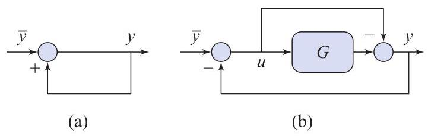

# Problem

## Problem Description

What is wrong with the feedback diagram in Fig. 4.23(a)?

Figure 4.23 Diagrams for P4.18 and P4.19.

## Subproblems

1. Write the algebraic relationship implied by the feedback diagram.
2. Determine whether the output \( y \) can be uniquely determined from the input \( \bar{y} \).
3. Explain what it means for a feedback diagram to be well-posed.
4. Introduce a feedback gain \( \alpha \) and analyze the modified system.
5. Examine the behavior of the system as \( \alpha \rightarrow 1 \).
6. Conclude why the original diagram is problematic.

## Additional Information

- The diagram represents a purely algebraic feedback loop.
- No dynamic elements (integrators or delays) are present.
- Well-posedness requires existence and uniqueness of signals.
- This problem concerns structural validity, not stability.

## Constraints

- Use algebraic signal relations only.
- Do not introduce dynamics unless explicitly stated.
- Clearly state assumptions about signal causality.
- The conclusion must address well-posedness.
