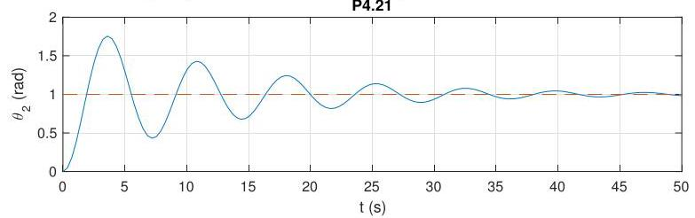

# Solution

## Method
At this point, we are provided with an angular reference signal instead of our previous angular velocity reference. That is, we need to generate the error signal

\[
e\left( t\right) = {\overline{\theta }}_{2} - {\theta }_{2}
\]

in closed loop. This requires us to modify our plant transfer function,

\[
G\left( s\right) = \frac{{\Theta }_{2}\left( s\right) }{T\left( s\right) }
= \frac{1}{s} \cdot \frac{{\Omega }_{2}\left( s\right) }{T\left( s\right) }
= \frac{\beta }{s\left( {s + \alpha }\right)},
\]

with \( \beta , \alpha \) as in P4.20, and to maintain the controller transfer function

\[
K\left( s\right) = {K}_{i}.
\]

In this case,

\[
S\left( s\right) = \frac{1}{1 + G\left( s\right) K\left( s\right) }
= \frac{s\left( {s + \alpha }\right) }{{s}^{2} + \alpha s + \beta {K}_{i}},
\]

with closed-loop poles

\[
{p}_{1/2} =
-\frac{\alpha }{2}
\pm
\frac{\sqrt{{\alpha }^{2} - 4\beta {K}_{i}}}{2},
\]

which are in the open left-half plane provided \( {K}_{i} > 0 \).

Given that the plant now has a pole at the origin, the closed-loop system achieves asymptotic tracking of a constant (angular position, not velocity) reference.

The closed-loop response to a reference input
\( {\overline{\theta }}_{2} = 1 \) rad with \( K = 1 \) should look as follows:

Note the zero tracking error.

## Teaching Points
1. Difference between angular velocity control and angular position control.
2. Effect of introducing an integrator in the plant dynamics.
3. Relati
