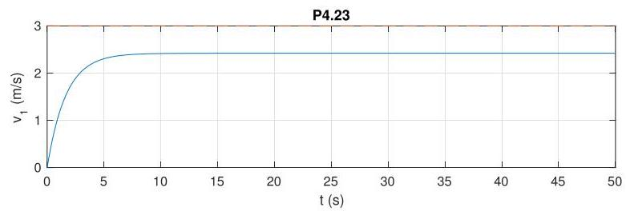

# Solution

## Method
We have

\[
{\dot{v}}_{1} + \alpha {v}_{1} = \beta \left( {\tau + w}\right),
\]

where

\[
\alpha =
\frac{{b}_{1} + {b}_{2}}{{J}_{1} + {J}_{2} + {r}^{2}\left( {{m}_{1} + {m}_{2}}\right)},
\quad
\beta =
\frac{r}{{J}_{1} + {J}_{2} + {r}^{2}\left( {{m}_{1} + {m}_{2}}\right)},
\quad
w = {gr}\left( {{m}_{1} - {m}_{2}}\right).
\]

Given the specified numerical parameters, we have \( {m}_{1} = {m}_{2} \), so that \( w = 0 \) for the rest of this problem. We thus obtain

\[
G\left( s\right) = \frac{{V}_{1}\left( s\right)}{T\left( s\right)} = \frac{\beta}{s + \alpha}.
\]

With a proportional controller \( K(s) = K \), the sensitivity function becomes

\[
S\left( s\right) = \frac{1}{1 + G\left( s\right)K}
= \frac{s + \alpha}{s + \alpha + \beta K},
\]

so that the closed-loop system is internally stable for all

\[
K > -\alpha.
\]

Since neither the plant nor the controller has a pole at the origin, the closed-loop system is type 0 and therefore cannot asymptotically track a constant velocity reference signal.

The closed-loop response to a reference input
\( {\bar{v}}_{1} = 3\,\mathrm{m/s} \) with \( K = 1000 \) should look as follows:

Note the nonzero tracking error. The reason for the large gain \( K \) is that the parameter \( \beta \) is very small.

## Teaching Points
1. Modeling of elevator dynamics using equivalent inertia and damping.
2. Role of mass balance in eliminating gravitational disturbances.
3. Interpretation of velocity control using proportional feedback.
4. Relationship between system type and steady-state tracking error.
5. Practical implications of small plant gain on controller design.
6. Trade-off between gain magnitude and tracking performance.
