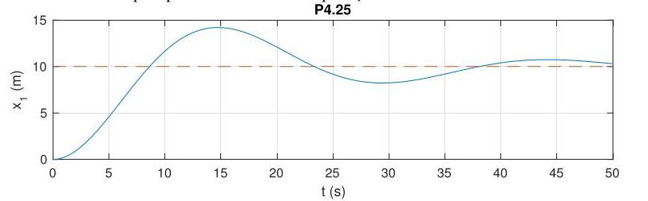

# Solution

## Method
Given that we are provided with a position reference signal instead of a velocity reference, our system and controller transfer functions now change to

\[
G\left( s\right) = \frac{{X}_{1}\left( s\right)}{T\left( s\right)}
= \frac{1}{s} \cdot \frac{{V}_{1}\left( s\right)}{T\left( s\right)}
= \frac{\beta}{s\left( {s + \alpha }\right)},
\]

\[
K\left( s\right) = K,
\]

with parameters as. This leads to

\[
S\left( s\right) = \frac{1}{1 + G\left( s\right) K\left( s\right)}
= \frac{s\left( {s + \alpha }\right)}{{s}^{2} + \alpha s + \beta K},
\]

such that internal stability is guaranteed for all \( K > 0 \).

In contrast with P4.23, we now achieve asymptotic tracking of a constant reference due to the new pole at the origin in our system transfer function \( G \), which produces a zero at zero in \( S \).

The closed-loop response to a reference input
\( {\bar{x}}_{1} = 10\,\mathrm{m} \) with \( K = 100 \) should look as follows:

Note the zero tracking error.

## Teaching Points
1. Difference between velocity control and position control.
2. Effect of introducing an integrator through kinematic relationships.
3. Relationship between system type and steady-state tracking error.
4. Closed-loop pole placement for second-order systems.
5. Importance of integrators for perfect tracking of step references.
6. Interpretation of sensitivity zeros in tracking performance.
