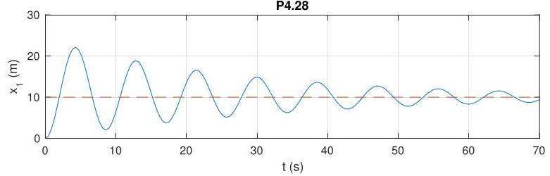

# Solution

## Method
Recall that

\[
G\left( s\right) = \frac{{X}_{1}\left( s\right)}{T\left( s\right)}
= \frac{1}{s} \cdot \frac{{V}_{1}\left( s\right)}{T\left( s\right)}
= \frac{\beta}{s\left( {s + \alpha }\right)}.
\]

In order to achieve simultaneous asymptotic tracking and input disturbance rejection for constant reference and disturbance signals, the controller has to have an integrator. For reasons that will become clear in Chapters 6 and 7, it is not possible to stabilize the system in closed loop with a simple integral controller,

\[
K\left( s\right) = \frac{K}{s}.
\]

Instead, one has to use a controller which also has a zero, such as

\[
K\left( s\right) = \frac{K\left( {s + z}\right)}{s}.
\]

In this case the sensitivity transfer function is equal to

\[
S(s) = \frac{1}{1 + G(s)K(s)}
= \frac{1}{1 + \frac{K\beta (s + z)}{s^{2}(s + \alpha)}}
= \frac{s^{2}(s + \alpha)}{s^{3} + \alpha s^{2} + K\beta s + K\beta z}.
\]

Again in anticipation of material covered in later chapters, any value of \( K > 0 \) will stabilize the closed-loop system provided that

\[
0 < z < \alpha.
\]

The closed-loop response to a reference input
\( {\bar{x}}_{1} = 10\,\mathrm{m} \)
with
\( z = \alpha/2 \)
and
\( K = 1000 \)
should look as follows:

Note the zero tracking error even in the presence of the input disturbance.

## Teaching Points
1. Necessity of integral action for tracking constant references.
2. Limitations of pure integral control in higher-order systems.
3. Role of controller zeros in stabilizing integrator-augmented systems.
4. Simultaneous disturbance rejection and reference tracking.
5. Interpretation of closed-loop characteristic polynomials.
6. Practical motivation for PI-type controllers in mechanical systems.
