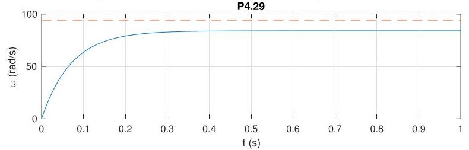

# Solution

## Method

We have

\[
\dot{\omega } + {\alpha \omega } = \beta {v}_{a},
\]

where

\[
\alpha  = \frac{b}{J} + \frac{{K}_{e}{K}_{t}}{J{R}_{a}}
\]

\[
\beta  = \frac{{K}_{t}}{J{R}_{a}}.
\]

The system and controller transfer functions are

\[
G\left( s\right)  = \frac{\beta }{s + \alpha }
\]

\[
K\left( s\right)  = K
\]

leading to the sensitivity transfer function

\[
S\left( s\right)  = \frac{1}{1 + G\left( s\right) K\left( s\right) } = \frac{s + \alpha }{s + \alpha  + {\beta K}},
\]

which renders the closed-loop system internally stable for all  
\( K >  - \alpha /\beta \).

Given that there are no poles at the origin in \( G\left( s\right) \) or \( K\left( s\right) \), the closed-loop system cannot asymptotically track constant reference signals.

The closed-loop response to a reference input  
\( \overline{\omega } = {2\pi 900}/{60}\mathrm{{rad}}/\mathrm{s} \) with \( K = 1 \) should look as follows:

Note the nonzero tracking error.

## Teaching Points

1. Modeling of DC motor dynamics using simplified first-order differential equations
2. Physical interpretation of system parameters \( \alpha \) and \( \beta \)
3. Use of proportional feedback for stabilization
4. Internal stability conditions for first-order linear systems
5. Relationship between system type and steady-state tracking error
6. Importance of integral action for zero steady-state error in constant reference tracking
7. Practical interpretation of simulation results and steady-state offset
