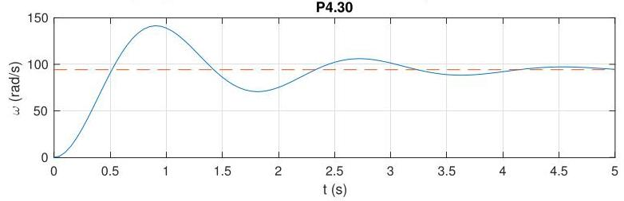

# Solution

## Method

In this case, we have

\[
G\left( s\right)  = \frac{\beta }{s + \alpha },\;K\left( s\right)  = \frac{{K}_{i}}{s},
\]

so that

\[
S\left( s\right)  = \frac{1}{1 + G\left( s\right) K\left( s\right) } = \frac{s\left( {s + \alpha }\right) }{{s}^{2} + {\alpha s} + \beta {K}_{i}},
\]

with poles at

\[
{p}_{1/2} =  - \frac{\alpha }{2} \pm  \sqrt{\frac{{\alpha }^{2}}{4} - \beta {K}_{i}}
\]

which means the closed-loop system is internally stable for all \( {K}_{i} > 0 \).

Given the pole at the origin in the controller transfer function \( K\left( s\right) \), the closed-loop system can track constant reference signals asymptotically.

The closed-loop response to a reference input  
\( \overline{\omega } = {2\pi 900}/{60}\mathrm{{rad}}/\mathrm{s} \) with \( K = 1 \) should look as follows:

Note the zero tracking error.

## Teaching Points

1. Role of integral control in eliminating steady-state error
2. Increase of system type through pole insertion at the origin
3. Closed-loop pole analysis for second-order systems
4. Relationship between controller gain and system damping
5. Internal stability versus tracking performance
6. Comparison between proportional and integral control strategies
7. Interpretation of time-domain responses in control systems
