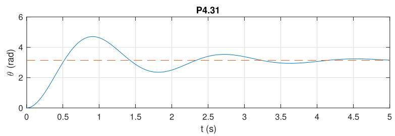

# Solution

## Method

In this case, we have

\[
G\left( s\right)  = \frac{\beta }{s\left( {s + \alpha }\right) },\;K\left( s\right)  = {K}_{i},
\]

with internal stability and asymptotic tracking as in P4.30.

The closed-loop response to a reference input  
\( \overline{\theta } = \pi \) rad with \( K = 1 \) should look as follows:

Note the zero tracking error.

## Teaching Points

1. Relationship between velocity dynamics and position dynamics
2. Effect of integration on system order and system type
3. Position control using proportional feedback
4. Comparison between velocity tracking and position tracking problems
5. Internal stability in higher-order closed-loop systems
6. Role of implicit integral action in position control
7. Interpretation of zero steady-state error for step references
