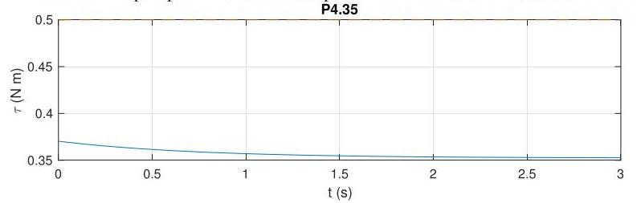

# Solution

## Method
We have the transfer functions

\[
G\left( s\right)  = \beta \frac{s + \gamma }{s + \alpha },
\]

\[
K\left( s\right)  = K
\]

where

\[
\beta  = \frac{{K}_{t}}{{R}_{a}},\;\gamma  = \frac{b}{J},\;\alpha  = \frac{b}{J} + \frac{{K}_{e}{K}_{t}}{J{R}_{a}},
\]

so that

\[
S\left( s\right)  = \frac{1}{1 + G\left( s\right) K\left( s\right) } = \frac{s + \alpha }{s + \alpha  + {K\beta }\left( {s + \gamma }\right) } = \frac{s + \alpha }{s\left( {1 + {K\beta }}\right)  + \alpha  + {K\beta \gamma }}
\]

that has a single pole at

\[
p =  - \frac{\alpha  + {K\beta \gamma }}{1 + {K\beta }}.
\]

With all constants positive, the closed-loop system is internally stable for all \( K \) such that

\[
K >  - {\beta }^{-1}\left( {\alpha /\gamma }\right) \;\text{ and }\;K >  - {\beta }^{-1}
\]

which holds only if \( K >  - {\beta }^{-1} \) because

\[
\alpha /\gamma  = 1 + \frac{{K}_{e}{K}_{t}}{{R}_{a}b} > 1.
\]

Since neither of the open-loop transfer functions have poles at the origin, the closed-loop system cannot asymptotically track a constant reference signal.

The closed-loop response to a reference input \( \overline{\tau } = {0.5} \) rad with \( K = {1000} \) should look as follows:

Note the nonzero tracking error and the nonzero initial response due to the presence of the zero.

## Teaching Points
1. Relationship between proportional feedback gain and internal stability
2. Interpretation of closed-loop pole locations
3. System type and steady-state tracking capability
4. Effect of system zeros on transient response
5. Limitations of proportional control for reference tracking
6. Connection between theoretical analysis and simulation results
