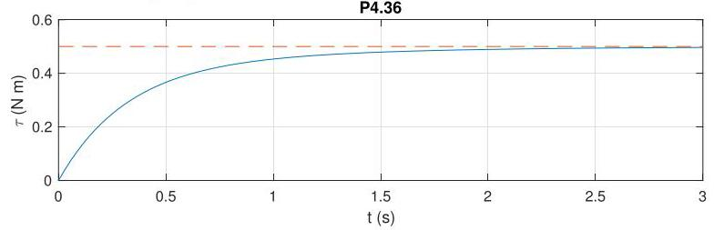

# Solution

## Method
We have

\[
G\left( s\right)  = \beta \frac{s + \gamma }{s + \alpha },\;K\left( s\right)  = \frac{{K}_{i}}{s},
\]

so that

\[
S\left( s\right)  = \frac{1}{1 + G\left( s\right) K\left( s\right) } = \frac{s\left( {s + \alpha }\right) }{s\left( {s + \alpha }\right)  + {K}_{i}\beta \left( {s + \gamma }\right) } = \frac{s\left( {s + \alpha }\right) }{{s}^{2} + \left( {\alpha  + {K}_{i}\beta }\right) s + {K}_{i}{\beta \gamma }}
\]

, with poles in the open left-half plane only if \( \left( {\alpha  + {K}_{i}\beta }\right)  > 0 \) and \( {K}_{i}{\beta \gamma } > 0 \) , which holds for all \( {K}_{i} > 0 \) . That is, the closed-loop system is internally stable for all \( {K}_{i} > 0 \) . Moreover, the pole at the origin in \( K\left( s\right) \) guarantees asymptotic tracking of constant reference signals.

The closed-loop response to a reference input \( \overline{\tau } = {0.5} \) rad with \( K = {1000} \) should look as follows:

Note the zero tracking error.

## Teaching Points
1. Effect of integral action on system type
2. Stability conditions for second-order closed-loop systems
3. Role of integrators in eliminating steady-state error
4. Interpretation of closed-loop pole locations
5. Comparison between proportional and integral control
6. Connection between mathematical analysis and time-domain response
