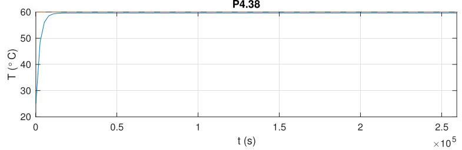
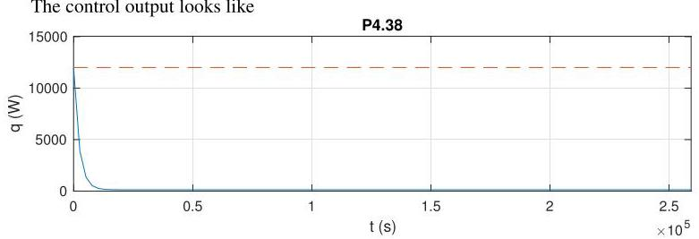

# Solution

## Method
For the following problems, we have

\[
\dot{T} + {\alpha T} = \beta \left( {q + \gamma }\right) ,
\]

where

\[
\alpha  = \frac{w}{m} + \frac{1}{mcR},\;\beta  = \frac{1}{mc},\;\gamma  = {wc}{T}_{i} + \frac{1}{R}{T}_{o}.
\]

We then have the open-loop transfer functions

\[
G\left( s\right)  = \frac{T\left( s\right) }{Q\left( s\right) } = \frac{\beta }{s + \alpha },
\]

so that

\[
S\left( s\right)  = \frac{1}{1 + G\left( s\right) K\left( s\right) } = \frac{s + \alpha }{s + \alpha  + {K\beta }},
\]

which means the closed-loop system is internally stable for all \( K >  - \alpha /\beta \) .

In closed-loop, starting at \( T\left( 0\right)  = {T}_{o} = {25}^{ \circ  }\mathrm{C} \) with \( \bar{T} = {60}^{ \circ  }\mathrm{C} \) , the maximum control \( q \) is attained at \( t = 0 \) , that is

\[
q\left( 0\right)  = K\left( {\bar{T} - T\left( 0\right) }\right)  = K\left( {{60} - {25}}\right)  = K \times  {35} \leq  {12} \times  {10}^{3}
\]

or

\[
K \leq  \frac{12}{35} \times  {10}^{3} \approx  {342}
\]

Selecting \( K = {342} \) the closed-loop time-constant is

\[
\frac{1}{\alpha  + {K\beta }} = \frac{1}{{4.67} \times  {10}^{-6} + K \times  {1.26} \times  {10}^{-6}} \approx  {2.29} \times  {10}^{3}\mathrm{\;s} \approx  {0.6}\text{ hours, }
\]

which compares with the open-loop time-constant:

\[
\frac{1}{\alpha } = \frac{1}{{4.67} \times  {10}^{-6}} \approx  {2.14} \times  {10}^{5}\mathrm{\;s} \approx  {59.5}\text{ hours } \approx  {2.47}\text{ days. }
\]

The closed-loop response should look like:

The average temperature on the three days is \( {59.1}^{ \circ  }\mathrm{C} \) and \( {59.6}^{ \circ  }\mathrm{C} \) in the last two days.

Given that we don't have any open-loop poles at the origin, the closed-loop system is not capable of asymptotically tracking a constant reference signal. Note the small tracking error due to the relatively large gain though.

confirming that the maximum power is never exceeded.

## Teaching Points
1. Modeling thermal systems as first-order dynamical systems
2. Interpretation of thermal resistance and heat capacity
3. Trade-off between response speed and actuator saturation
4. Comparison of open-loop and closed-loop time constants
5. Limitations of proportional control in steady-state tracking
6. Validation of analytical results using simulation
