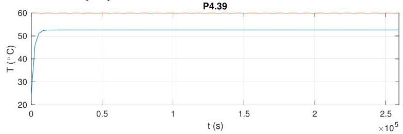
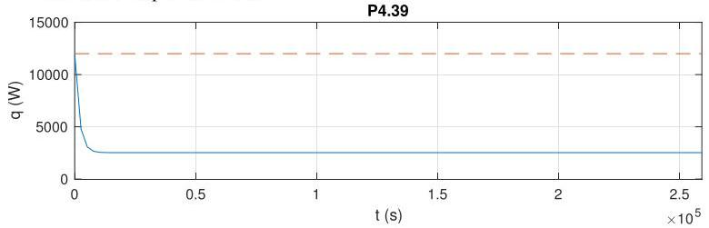

# Solution

## Method
See answer as in P4.38, only the numerical values change.

Selecting \( K = {342} \) the closed-loop time-constant is

\[
\frac{1}{\alpha  + {K\beta }} = \frac{1}{{1.15} \times  {10}^{-4} + K \times  {1.26} \times  {10}^{-6}} \approx  {1.83} \times  {10}^{3}\mathrm{\;s} \approx  {0.5}\text{ hours. }
\]

which compares with the open-loop time-constant:

\[
\frac{1}{\alpha } = \frac{1}{{1.15} \times  {10}^{-4}} \approx  {8.68} \times  {10}^{3}\mathrm{\;s} \approx  {2.41}\text{ hours } \approx  {0.1}\text{ days }
\]

The closed-loop response should look like:

The average temperature on the three days is \( {52.3}^{ \circ  }\mathrm{C} \) and \( {52.6}^{ \circ  }\mathrm{C} \) in the last two days.

Given that we don't have any open-loop poles at the origin, the closed-loop system is not capable of asymptotically tracking a constant reference signal. Note how the disturbance (the water flow) affects the closed-loop performance by producing a noticeable error in the temperature.

The control output looks like

confirming that the maximum power is never exceeded.

## Teaching Points
1. Modeling constant flow as a disturbance input
2. Effect of mass flow on thermal time constants
3. Disturbance rejection limitations of proportional control
4. Relationship between system type and disturbance rejection
5. Interpretation of steady-state error under constant disturbances
6. Comparison between zero-flow and nonzero-flow operating conditions
