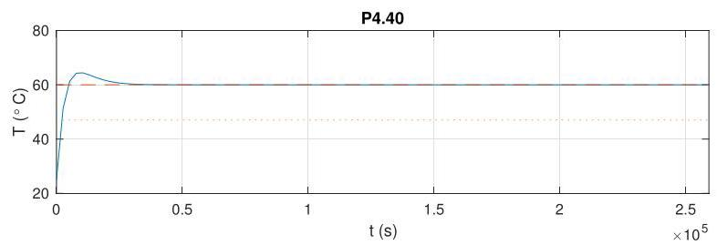
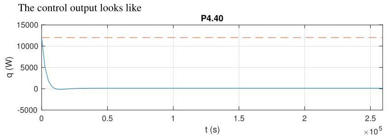

# Solution

## Method
We now have

\[
G\left( s\right)  = \frac{T\left( s\right) }{Q\left( s\right) } = \frac{\beta }{s + \alpha },\;K\left( s\right)  = \frac{{K}_{i} + {K}_{p}s}{s},
\]

so that

\[
S\left( s\right)  = \frac{1}{1 + G\left( s\right) K\left( s\right) } = \frac{s\left( {s + \alpha }\right) }{{s}^{2} + s\left( {\alpha  + {K}_{p}\beta }\right)  + {K}_{i}\beta },
\]

which has poles in the open left-half plane whenever \( {K}_{p} >  - \alpha /\beta \) and \( {K}_{i} > 0 \) . Given the controller pole at the origin, we can asymptotically track a constant reference while rejecting the constant input disturbance.

If we select \( {K}_{i} \) such that \( \sqrt{{K}_{i}\beta } = \left( {\alpha  + {K}_{p}\beta }\right) /2 \) , that is

\[
{K}_{i} = \frac{{\left( \alpha  + {K}_{p}\beta \right) }^{2}}{4\beta }
\]

the closed-loop response will have two repeated real poles and so will have no oscillations. Also the maximum control will coincide with the initial time, so that we can chose \( {K}_{p} = {342} > \alpha /\beta  = {3.7} \) as before. With that choice, the closed-loop response looks like:

\[
\tau  = {2.62} \times  {10}^{3}\mathrm{\;s} \approx  {0.73}\text{ hours. }
\]

The average temperature on the three days is \( {59.78}^{ \circ  }\mathrm{C} \) and \( {60.0}^{ \circ  }\mathrm{C} \) in the last two days, confirming the tracking capabilities of the closed-loop.

We assess the closed-loop time-constant from the plot to be the time in which the response crosses the dotted line for the first time, which correspond to

confirming that the maximum power is never exceeded.

NOTE: A selection of complex closed-loop poles will lead to all sorts of troubles in this question, including the determination of the maximum value of control and the presence of negative power, which are not realizable by a heater. Indeed, even the plot above shows that the power goes momentarily to a small negative value! You might want to ask for real poles as an additional requirement.

## Teaching Points
1. Structure and interpretation of PI controllers
2. Role of integrators in reference tracking and disturbance rejection
3. Pole placement for non-oscillatory thermal responses
4. Physical constraints in controller design
5. Consequences of complex poles in actuator-limited systems
6. Relationship between analytical design and simulation results
