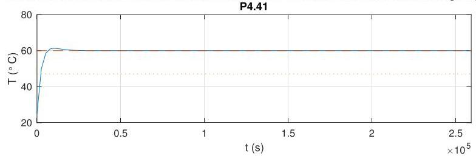
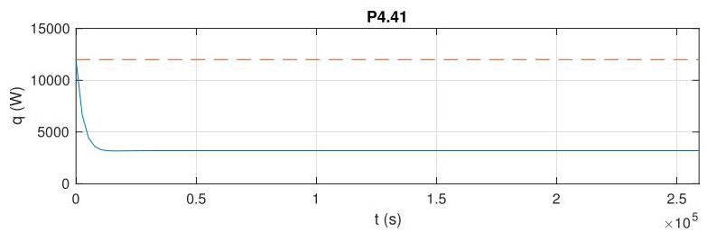

# Solution

## Method

See answer as in P4.40, only the numerical values change.

We chose \( {K}_{p} = {342} > \alpha /\beta  = {91.4} \) as before and

\[
{K}_{i} = \frac{{\left( \alpha  + {K}_{p}\beta \right) }^{2}}{4\beta }
\]

so that the closed-loop response will have two repeated real poles and so will have no oscillations. Also the maximum control will coincide with the initial time. With that choice, the closed-loop response looks like:

\[
\tau  = {2.62} \times  {10}^{3}\mathrm{\;s} \approx  {0.73}\text{ hours. }
\]

The average temperature on the three days is \( {59.6}^{ \circ  }\mathrm{C} \) and \( {60.0}^{ \circ  }\mathrm{C} \) in the last two days, confirming the closed-loop tracking capabilities even in the presence of a disturbance.

We assess the closed-loop time-constant from the plot to be the time in which the response crosses the dotted line for the first time.

The control output looks like

confirming that the maximum power is never exceeded. The value the control converges to is the value necessary to offset the disturbance.

NOTE: A selection of complex closed-loop poles will lead to all sorts of troubles in this questions, including the determination of the maximum value of control and the presence of negative power, which are not realizable by a heater. You might want to ask for real poles as an additional requirement.

## Teaching Points

1. Integral control is essential for asymptotic rejection of constant disturbances.
2. Repeated real poles can be used to avoid oscillatory thermal responses.
3. Controller design must respect actuator saturation and physical constraints.
4. Time-domain analysis provides insight into disturbance rejection performance.
5. Poor pole placement can lead to non-physical or unsafe control actions.
