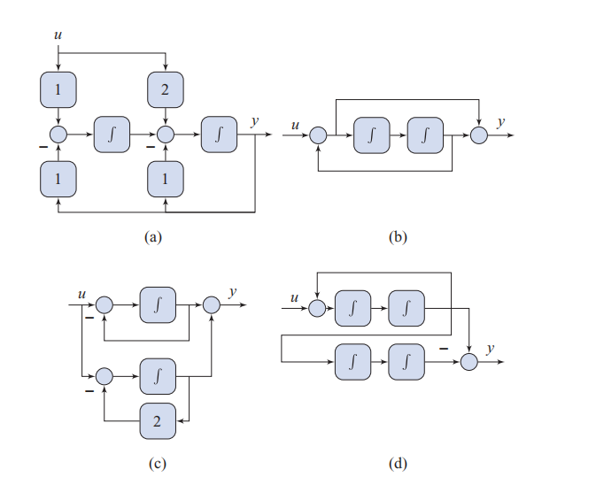

# Problem

## Problem Description

Write state-space equations for the block-diagrams in Fig. 5.17 and, in each case, compute the transfer-function from the input \( u \) to the output \( y \).

The diagrams consist of interconnected integrators with algebraic summing junctions. Each realization corresponds to a different internal state choice and structure.

FIGURE 5.17 
## Subproblems

1. For each block-diagram, define appropriate state variables.
2. Write the corresponding state-space equations in matrix form.
3. Identify the output equation.
4. Compute the transfer-function \( \frac{Y(s)}{U(s)} \) from the state-space representation.
5. Simplify the resulting transfer-function.
6. Comment on any pole-zero cancellations that occur.

## Additional Information

- All systems are linear and time-invariant.
- Integrators are ideal.
- State variables are chosen as outputs of integrators.
- The realizations illustrate different canonical and non-canonical forms.

## Constraints

- Use minimal assumptions beyond the given diagrams.
- Clearly define state variables.
- Use Laplace-domain analysis where appropriate.
- Explicitly state all intermediate steps.
