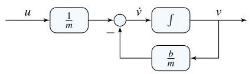

# Solution

## Method

Isolate the highest derivative to write

\[
\dot{v} =  - \frac{b}{m}v + \frac{1}{m}u,\;u = {mg}
\]

\[
y = v
\]

A possible state-space representation is:

\[
x = v,\;A =  - \frac{b}{m},\;B = \frac{1}{m},\;C = 1,\;D = 0.
\]

A possible block-diagram is:

## Teaching Points

1. First-order mechanical systems can be modeled with a single state.
2. Isolating the highest derivative simplifies state-space formulation.
3. Integrator-based block diagrams directly reflect system dynamics.
4. Physical forces translate naturally into system inputs.
5. Linear drag leads to stable first-order dynamics.
