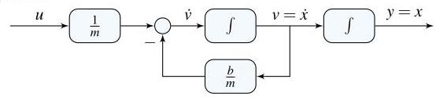

# Solution

## Method

Another way to express a relationship between \( x \) and \( v \) is as in

\[
\dot{x} = v
\]

Adding this relationship to the equations from P5.8:

\[
\dot{v} =  - \frac{b}{m}v + \frac{1}{m}u,\;u = {mg}
\]

\[
\dot{x} = v
\]

\[
y = x
\]

which is in state-space with

\[
x = \left( \begin{array}{l} v \\  x \end{array}\right) ,\;A = \left\lbrack  \begin{matrix}  - \frac{b}{m} & 0 \\  1 & 0 \end{matrix}\right\rbrack  ,\;B = \left\lbrack  \begin{matrix} \frac{1}{m} \\  0 \end{matrix}\right\rbrack  ,\;C = \left\lbrack  \begin{array}{ll} 0 & 1 \end{array}\right\rbrack  ,
\]

A possible block-diagram is:

## Teaching Points

1. Changing the output may require augmenting the state vector.
2. Position is obtained by integrating velocity, increasing system order.
3. State-space models naturally accommodate multiple physical quantities.
4. Block-diagrams with integrators mirror the physical accumulation process.
5. Output selection affects observability but not internal dynamics.
