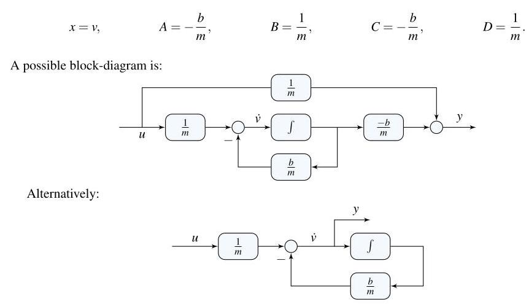

# Solution

## Method

\[
\dot{v} =  - \frac{b}{m}v + \frac{1}{m}u,\;u = {mg}
\]

\[
y = \dot{v} =  - \frac{b}{m}v + \frac{1}{m}u
\]

which is in state-space with

## Teaching Points

1. Outputs need not be states; they can be algebraic combinations of states and inputs.
2. Acceleration follows directly from Newton’s second law.
3. Changing the output does not alter the system’s internal dynamics.
4. State-space models flexibly accommodate different measurement choices.
5. Physical meaning of outputs guides sensor selection in practice.
