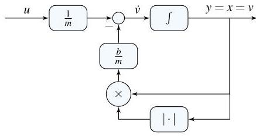

# Solution

## Method

Isolate the highest derivative to obtain

\[
\dot{v} = -\frac{b}{m}|v|v + u, \quad u = mg
\]

and define the output as

\[
y = v
\]

This representation is already in state-space form with a single state variable \( v \).

A possible block-diagram consists of:
- A summation of the input \( u \) and the nonlinear drag term \( -\frac{b}{m}|v|v \)
- An integrator whose output is the velocity \( v \)
- A feedback loop generating the nonlinear resistance force

An example block-diagram implementation is shown below:

## Teaching Points

1. Conversion of higher-order differential equations into state-space form
2. Representation of nonlinear dynamics in block-diagram structures
3. Modeling of quadratic drag forces in mechanical systems
4. Proper selection of system input and output variables
5. Use of integrators as fundamental dynamic elements in system modeling
