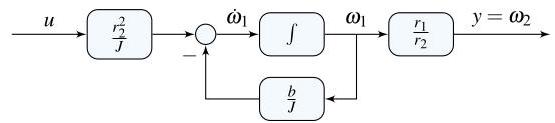

# Solution

## Method
Isolate the highest derivative to write

\[
{\dot{\omega }}_{1} = - \frac{b}{J}{\omega }_{1} + \frac{{r}_{2}^{2}}{J}u,\;u = \tau
\]

\[
y = {\omega }_{2} = \frac{{r}_{1}}{{r}_{2}}{\omega }_{1}
\]

where \( J = \left( {{J}_{1}{r}_{2}^{2} + {J}_{2}{r}_{1}^{2}}\right) \),  
\( b = \left( {{b}_{1}{r}_{2}^{2} + {b}_{2}{r}_{1}^{2}}\right) \).

A possible state-space representation is:

\[
x = {\omega }_{1},\;
A = - \frac{b}{J},\;
B = \frac{{r}_{2}^{2}}{J},\;
C = \frac{{r}_{1}}{{r}_{2}},\;
D = 0
\]

A possible block-diagram is:

## Teaching Points
1. Reduction of coupled mechanical systems to equivalent single-shaft models
2. Interpretation of gear and belt ratios in dynamic equations
3. Construction of integrator-based block-diagrams
4. Transition from differential equations to state-space form
5. Physical meaning of state, input, and output variables
