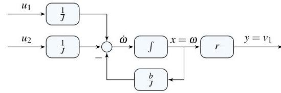

# Solution

## Method
Isolate the highest derivative to write

\[
\dot{\omega } = - \frac{b}{J}\omega + \frac{1}{J}u_{1} + \frac{1}{J}u_{2},\;
u_{1} = \tau ,\;
u_{2} = gr\left( {{m}_{1} - {m}_{2}}\right)
\]

\[
y = {v}_{1} = r\omega
\]

where  
\( J = {J}_{1} + {J}_{2} + {r}^{2}\left( {{m}_{1} + {m}_{2}}\right) \),  
\( b = {b}_{1} + {b}_{2} \).

A possible state-space representation is:

\[
x = \omega ,\;
A = - \frac{b}{J},\;
B = \begin{bmatrix} \frac{1}{J} & \frac{1}{J} \end{bmatrix},\;
C = r,\;
D = \begin{bmatrix} 0 & 0 \end{bmatrix}
\]

A possible block-diagram is:

## Teaching Points
1. Modeling of electromechanical elevator systems
2. Inclusion of gravitational effects as external inputs
3. Handling multiple inputs in state-space models
4. Use of integrator-only block-diagram realizations
5. Relationship between rotational and translational motion
