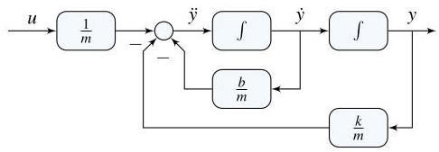

# Solution

## Method
Isolate the highest derivative to write

\[
\ddot{x} = - \frac{b}{m}\dot{x} - \frac{k}{m}x + \frac{1}{m}u,\;
u = mg\sin \theta
\]

\[
y = x
\]

A possible state-space representation is:

\[
x = 
\begin{pmatrix}
\dot{x} \\
x
\end{pmatrix},
\;
A =
\begin{bmatrix}
-\frac{b}{m} & - \frac{k}{m} \\
1 & 0
\end{bmatrix},
\;
B =
\begin{bmatrix}
\frac{1}{m} \\
0
\end{bmatrix},
\;
C =
\begin{bmatrix}
0 & 1
\end{bmatrix}
\]

A possible block-diagram is:

## Teaching Points
1. Modeling second-order mechanical systems using state variables
2. Conversion of Newtonian equations into state-space form
3. Interpretation of gravitational force as an external input
4. Construction of integrator-only block-diagrams
5. Relationship between physical motion and mathematical states
