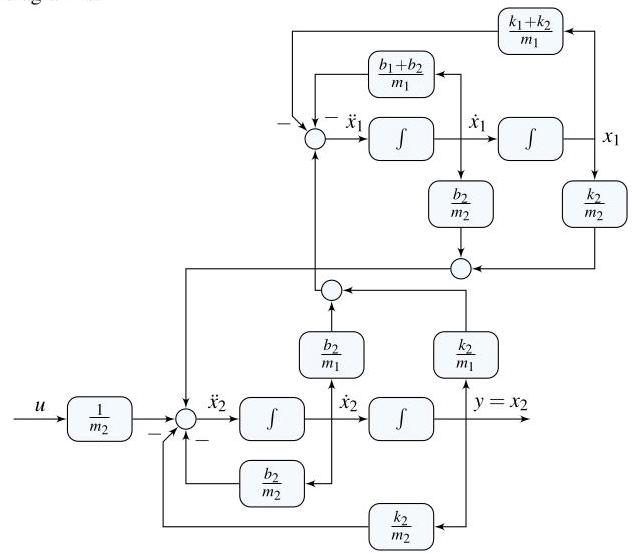

# Solution

## Method
Isolate the highest derivatives to write the equations in first-order form.

A possible state-space representation is:

\[
x = \left( \begin{array}{l} \dot{x}_{1} \\ x_{1} \\ \dot{x}_{2} \\ x_{2} \end{array}\right),
\]

\[
A = \left[
\begin{matrix}
-\dfrac{b_1 + b_2}{m_1} & - \dfrac{k_1 + k_2}{m_1} & \dfrac{b_2}{m_1} & \dfrac{k_2}{m_1} \\
1 & 0 & 0 & 0 \\
\dfrac{b_2}{m_2} & \dfrac{k_2}{m_2} & - \dfrac{b_2}{m_2} & - \dfrac{k_2}{m_2} \\
0 & 0 & 1 & 0
\end{matrix}
\right],
\]

\[
B = \left[
\begin{matrix}
0 \\
0 \\
\dfrac{1}{m_2} \\
0
\end{matrix}
\right].
\]

The output equation is

\[
y = \left[ 0 \;\; 0 \;\; 0 \;\; 1 \right] x,
\]

since the output is the displacement \( x_2 \).

A possible block-diagram realization consists of cascaded integrators generating velocities and displacements, with feedback paths implementing the stiffness and damping forces according to the coefficients in the state equations.

## Teaching Points
1. Conversion of second-order mechanical equations into first-order state-space form
2. Proper selection and physical interpretation of state variables
3. Representation of mechanical systems using integrator-based block diagrams
4. Relationship between differential equations and state matrices
5. Mapping physical parameters to system dynamics
