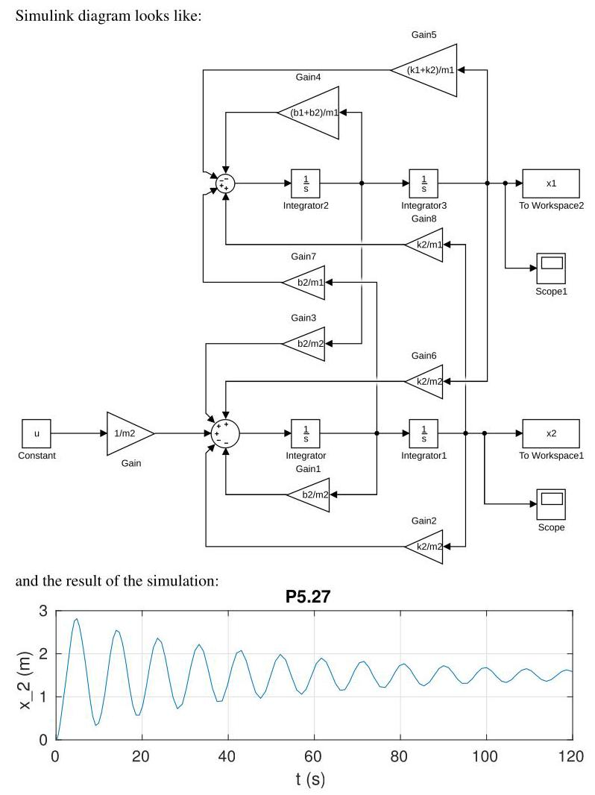

# Solution

## Method
Using MATLAB and the state-space model obtained, substitute the numerical parameter values to obtain the system matrices.

The state-space matrices are:

\[
A =
\begin{bmatrix}
-0.2000 & -3.0000 & 0.1000 & 2.0000 \\
1.0000 & 0 & 0 & 0 \\
0.1000 & 2.0000 & -0.1000 & -2.0000 \\
0 & 0 & 1.0000 & 0
\end{bmatrix},
\]

\[
B =
\begin{bmatrix}
0 \\
0 \\
1 \\
0
\end{bmatrix},
\quad
C =
\begin{bmatrix}
0 & 0 & 0 & 1
\end{bmatrix},
\quad
D = 0.
\]

The transfer function from the force \( f_2 \) to the displacement \( x_2 \) is computed in MATLAB using

\[
\operatorname{zpk}\left( \operatorname{ss}(A,B,C,D) \right).
\]

MATLAB returns the zero-pole-gain form:

\[
\frac{s^2 + 0.2s + 3}
{(s^2 + 0.04086s + 0.4385)(s^2 + 0.2591s + 4.561)}.
\]

Since all poles have strictly negative real parts, the system is **asymptotically stable**.

To analyze the time response, the system is simulated with zero initial conditions and a constant force input \( f_2 = 1\mathrm{\,N} \). The displacement \( x_2(t) \) converges to a finite steady-state value after a transient oscillatory response, confirming stability.

## Teaching Points
1. Numerical evaluation of state-space models
2. Use of MATLAB for transfer-function computation
3. Interpretation of pole locations for stability analysis
4. Relationship between mechanical parameters and dynamic response
5. Time-domain simulation of linear systems
