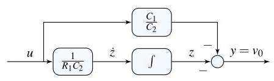

# Solution

## Method
Use linearity to rewrite the differential equation by introducing an auxiliary variable \( z \):

\[
{R}_{1}{C}_{2}\dot{z} = u,\quad u = v
\]

and define the output equation as

\[
{v}_{0} = - {R}_{1}{C}_{1}\dot{z} - z.
\]

Isolating the highest derivative gives

\[
\dot{z} = \frac{1}{{R}_{1}{C}_{2}} u.
\]

Substituting this expression into the output equation yields

\[
{v}_{0} = - z - \frac{{R}_{1}{C}_{1}}{{R}_{1}{C}_{2}} u
        = - z - \frac{{C}_{1}}{{C}_{2}} u.
\]

A possible state-space representation is therefore

\[
x = z,\quad
A = 0,\quad
B = \frac{1}{{R}_{1}{C}_{2}},\quad
C = -1,\quad
D = -\frac{{C}_{1}}{{C}_{2}}.
\]

The corresponding block-diagram consists of a single integrator generating the state \( z \), with appropriate feedforward and feedback gains to form the output \( v_0 \).

## Teaching Points
1. Reduction of differential equations using auxiliary state variables
2. State-space modeling of electrical circuits
3. Use of integrators in block-diagram realizations
4. Interpretation of feedthrough terms in state-space models
5. Relationship between circuit parameters and system dynamics
