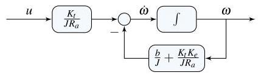

# Solution

## Method
Isolate the highest derivative in the differential equation to obtain

\[
\dot{\omega}
= -\left( \frac{b}{J} + \frac{K_t K_e}{J R_a} \right)\omega+ \frac{K_t}{J R_a} v_a.
\]

Choosing the angular velocity as the state variable,

\[
x = \omega,
\]

a possible state-space representation is

\[
A = - \frac{b}{J} - \frac{K_t K_e}{J R_a},\quad
B = \frac{K_t}{J R_a},\quad
C = 1,\quad
D = 0.
\]

The corresponding block-diagram realization consists of a single integrator generating the state \( \omega \), with a feedback gain implementing viscous friction and back-emf effects, and a feedforward gain from the input voltage.

## Teaching Points
1. Simplification of electromechanical systems into first-order models
2. Selection of physical state variables
3. Representation of back-emf effects in DC motor models
4. Integrator-based realization of state equations
5. Interpretation of mechanical and electrical parameters in control models
